# materia

[TOC]

# Mapa conceptual asignatura

# Glosario

1. **TGS**: teoría general de Sistemas
2. **SGC**: Sistema de gestión de la Calidad
3. **JIT**: Estilo sistémico muy utilizado en Japón, la simple traducción “justo a tiempo” no refleja toda la riqueza del concepto, es más que tener las existencias a la vista o disponer de las partes de un producto antes de emplearlas en la línea de producción, significa cultivar una relación basada en confianza, de interdependencia.
4. **KANBAN**: Modelo donde, manteniendo una estructura semiespecializada del proceso, se procesa de a una pieza a la vez en cada eslabón de la línea. Si hay una falla, todas las personas en la cadena se detienen y ayudan a corregir el problema.
5. **Lean Manufacturing**: Modelo de gestión basado en tres pilares fundamentales: aportar valor al cliente, reducir el despilfarro y trabajar con procesos flexibles.
6. **BPM**: (Business process management) La Gestión de Procesos de Negocio es una disciplina de gestión compuesta de metodologías y tecnologías, cuyo objetivo es mejorar el desempeño y la optimización de los procesos de una organización.

# Teoria general de sistemas

## Introduccion

> Es el estudio interdisciplinario de los sistemas, en general, con el propósito de dilucidar los principios que pueden ser aplicados a todo tipo de sistemas en todos los niveles anidados en todos los campos de la investigación. Ludwig Von Bertalaffy

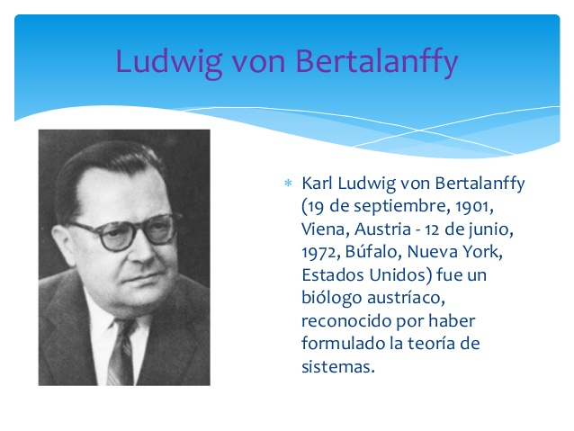

---

La Teoría General de Sistemas describe un nivel de construcción teórico de modelos que se sitúa entre las construcciones altamente generalizadas, de las matemáticas puras y las teorías específicas de las disciplinas especializadas y que en los últimos años ha hecho sentir con fuerza la necesidad de un cuerpo sistemático de construcciones teóricas que pueda discutir, analizar y explicar las relaciones generales del mundo empírico. **No se busca establecer una teoría general única y total**.

---

Mientras más se divide la ciencia en sub grupos y menor sea la comunicación entre las disciplinas, mayor es la probabilidad de que el crecimiento total del conocimiento sea reducido por la pérdida de comunicación relevante .

## Clasificacion de los sistemas

- **Sistemas Naturales**: Aquellos sistemas que han sido elaborados por la naturaleza, desde el nivel de estructuras atómicas hasta los sistemas vivos, los sistemas solares y el universo.
- **Sistemas Diseñados**: Aquellos diseñados por el hombre y son parte del mundo real. Pueden ser de dos tipos: Abstractos y Concretos

---

- **Sistemas de Actividad Humana**: Son sistemas que describen al ser humano a través de lo que hace. Se basan en la apreciación de lo que en el mundo real una persona o grupos de personas podrían estar haciendo. (Hombre –maquina).

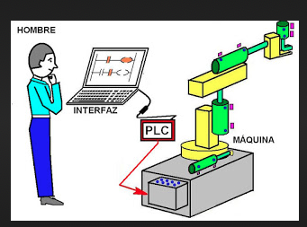

- **Sistemas Culturales**: Sistemas formados por la agrupación de personas, podría hablarse de la empresa, la familia, el grupo de estudio de la universidad, etc.

## Sinergia

Cuando la suma de las partes es diferente del todo; cuando un objeto cumple con este principio o requisito decimos que posee o existe sinergia.
Un objeto posee sinergia cuando el examen de una o alguna de sus partes (incluso a cada una de sus partes) en forma aislada, no puede explicar o predecir la conducta del todo.

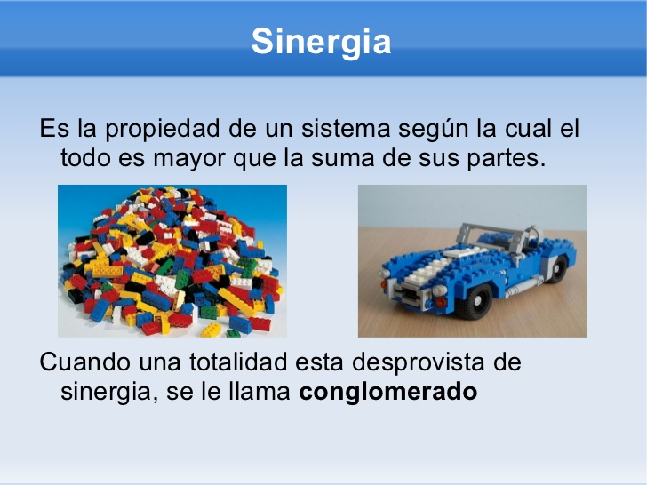

> La empresa es una totalidad con sinergia. Peter F. Drucker (Liderazgo, emprendimiento, sociedad del conocimiento)

Sin mencionar el término sinergia lo describe:

> "La empresa debe ser capaz, por definición, de producir más o mejor que todos los recursos que comprende. Debe ser un verdadero todo: mayor que la suma de sus partes, o, por lo menos, diferente a ella , con un rendimiento mayor que la suma de todos los consumos".

## Recursividad

El hecho de que un objeto sinergético, un sistema, esté compuesto de partes con características tales que son a su vez objetos sinergéticos (sistemas). Hablamos entonces de sistemas y subsistemas. O, si queremos ser más extensos, de súper sistemas, sistemas y subsistemas. Lo esencial es que cada uno de estos objetos, no importando su tamaño, tiene propiedades que lo convierten en una totalidad, es decir, en elemento independiente .

---

Esto no significa que todos los elementos de una totalidad sean totalidades a su vez. Si tenemos un conjunto de elementos tales como una célula, un hombre, un grupo humano y una empresa, es probable que, a primera vista, no observemos entre ellos ninguna relación. Sin embargo, un rápido análisis nos puede llevar a la conclusión de que sí existen relaciones. El hombre es un conjunto de células y el grupo es un conjunto de hombres . Luego podemos establecer aquí una recursividad célula-hombre-grupo

---

De todo esto se desprende que el concepto de recursividad se aplica a sistemas dentro de sistemas mayores, y a ciertas características particulares, más bien funciones o conductas propias de cada sistema, que son semejantes a la de los sistemas mayores.

Ejemplo: Empresa (Aspectos Dirección y Producción)

## Entropia

En general, todo sistema diseñado para alcanzar un objetivo requiere de energía que recibe a través de la corriente de entrada (alimentos, vapor, electricidad, materias primas u otras fuentes). Esta energía dentro del sistema puede convertirse en **energía cinética o potencial**. La primera, se encuentra relacionada con la velocidad de un cuerpo, aunque algo de ella se pierde por la fricción de éste con el medio. (caminar, empujar un cuerpo ,transportar un objeto, etc.).

---

La energía potencial se encuentra relacionada con la masa del cuerpo y los cambios de altura. Esta es la energía contenida en una cascada, la que se manifiesta cuando levantamos algún objeto, cuando subimos un cerro , etc.

Normalmente , al realizar un trabajo , el sistema desarrolla ambas formas de energía. Por ejemplo , si empujamos un objeto sobre un plano inclinado, la presión que realizamos se divide parte en energía cinética (el movimiento de translación) y parte de energía potencial (el movimiento de elevación), y por supuesto , pérdidas friccionales por el roce

---

Como todo proceso natural o humano, implica utilización o transformación de energía , los principios o leyes de la termodinámica se aplican tanto al acto de admirar una  escultura, diseñar una construcción, llevar a cabo una investigación, manejar una máquina u analizar el universo.

Cuando dos cuerpos que poseen la misma temperatura son colocados uno al lado de otro , sus temperaturas permanecen constantes (Ley cero). Entre uno y otro cuerpo no existe un flujo neto de energía calórica. Ambos cuerpos se encuentran en un equilibrio.

---

¿Qué sucede cuando los dos objetos no poseen la misma temperatura?

La respuesta a este problema la encontramos en la segunda ley de la termodinámica, que dice que existirá un flujo neto de energía y siempre desde el cuerpo más caliente al más frío . Si dejamos nuestra taza de café con su temperatura de 50° algún rato sobre la mesa, observaremos cuando lo tomemos, que se ha enfriado . La taza de café perdió temperatura debido a su exposición a un medio más frío.

---

Una mejor forma de expresar esta segunda ley de la termodinámica Se basa en la observación de que cuando ciertos estados del sistema son más probables que otros, **el sistema siempre se moverá en la dirección del estado más probable.**

---

Si observáramos con los instrumentos apropiados, notaríamos que cuando el café estaba caliente, las moléculas  de agua chocaban violentamente de una manera caótica. Sin embargo, a pesar de este caos o movimiento al azar, existe un flujo neto de energía desde el café hacia el aire . Ya sea frío o caliente , la energía total contenida en la taza y en la pieza permanece constante. Es decir, podemos suponer que toda la energía calórica permanece en el cuarto.

---

Cuando el café se enfría, cesa de existir ese flujo neto de energía. Podemos decir que el sistema, ante la falta de un flujo neto de energía, está en una situación aún más caótica y al azar.

Del estado "ordenado" en el cual el café caliente es una situación organizada, con un "propósito", el sistema ahora es reducido a un “desorden” molecular mayor.

---

**¿Qué es la entropía?**

Cantidad física mensurable tal como el largo de una cuerda , la temperatura de cualquier punto del cuerpo.

La entropía ejerce su acción en los sistemas aislados, es decir, aquellos que no "comercian" con su medio. Luego podemos afirmar concretamente que estos sistemas se encuentran condenados al caos y a la destrucción.

Los objetos físicos tienden a ser sistemas cerrados, y ésto, evidentemente, tienen una vida limitada.

---

Todo esto es válido para los sistemas cerrados,

¿pero qué pasa con los sistemas abiertos o los sistemas vivos?

¿Cómo logra un organismo viviente evitar ese decaimiento que observábamos en los sistemas cerrados?

---

Podemos pensar que todos los sistemas se ven atacados  por la ley de la entropía, sin embargo , la simple observación del transcurso histórico de numerosos sistemas, parece contradecir este aspecto de la ley de la entropía siempre creciente. Por ejemplo, la Iglesia Católica, los países , las empresas industriales , la familia , etc. Esta contradicción o violación de la ley de la entropía es más aparente que real.  Si observamos los sistemas que "violan" la ley, podemos concluir que ellos poseen una importante característica en común.

**Todos son sistemas vivos y, más general aún , son todos sistemas abiertos.**

---

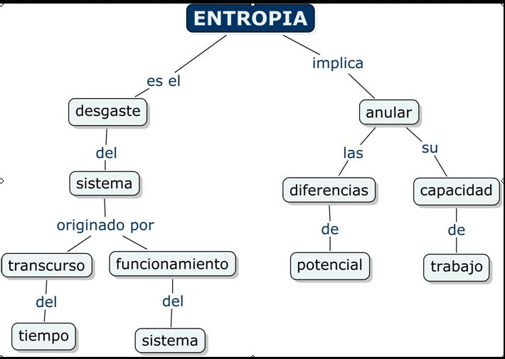

## Negentropia

La expresión "entropía negativa" (o neguentropía) es en sí una medida de orden. De este modo, el mecanismo mediante el cual el organismo se mantiene estacionario y a un nivel bastante alto de ordenamiento, realmente consiste en extraer continuamente orden (u organización) de su medio .
Así, los sistemas abiertos al extraer orden del medio y reemplazar con él el desorden producido por sus procesos vitales, rompen la ley inexorable que ataca a los sistemas: la entropía creciente. Podemos, entonces, establecer claramente una nueva distinción entre sistema cerrado y sistema abierto .

---

---

---

Ejemplos practicos de negentropia:

## Homeostasis

Hace referencia al carácter adaptativo de los sistemas ante cualquier estimulo, cambio o influencia externa. La empresa no es un sistema puramente homeostático. No se adapta automáticamente a cualquier influencia.
La organización puede alcanzar un estado solido, cuando se presenta los requisitos de:

**Unidireccionalidad**: significa que a pesar de que hayan cambios en la empresa, los mismos resultados establecidos son alcanzados.

**Progreso**: referido al fin deseado, es un grado de progreso que está dentro de los límites definidos como tolerables.

La unidireccionalidad y el progreso solo pueden ser alcanzados con liderazgo y compromiso.

La homeostasis es el rasgo de los sistemas autorregulados que consiste en mantener un estado de equilibrio dinámico, en el cual su composición y estructura se mantienen constantes dentro de ciertos límites.

---

Es la propiedad de un sistema que define su nivel de respuesta y de adaptación al contexto (Equilibrio Interno).

Ejemplos:

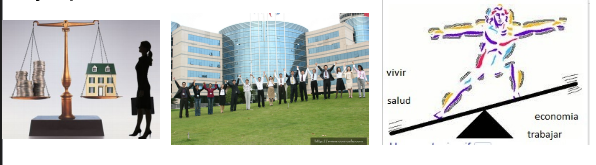

---

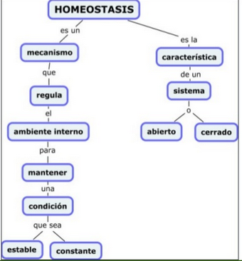

# Sistemas y subsistemas

## Sistema

Ante la palabra "sistemas", todos los que la han definido están de acuerdo en que es un conjunto de partes  coordinadas y en interacción para alcanzar un conjunto de objetivos.

Un sistema es un grupo de partes y objetos que interactúan y que forman un todo o que se encuentran bajo la influencia de fuerzas en alguna relación definida.

Definición más universal (General Systems Society for Research) que define a los sistemas como "un conjunto de partes y sus interrelaciones“.

---

Un ejemplo lo constituye un grupo de trabajo, digamos un departamento de Investigación de una empresa.

Para los propietarios, este grupo es una unidad administrativa compuesto por un número determinado de personas, que se pueden dividir en jefes y subordinados, y cuyo número varía lentamente. El cuadro es radicalmente más complejo para quien está cerca de este departamento como para observar las acciones dinámicas y los cambios que tienen lugar.

---

Situaciones que parecen "normales" pueden ser relativamente superficiales cuando, por ejemplo, un superior pide algo a un subordinado (o viceversa). Esta acción supone cierta influencia de un personaje sobre el otro . Sin embargo, rara vez esta influencia es unidireccional, porque las reacciones del subordinado a su vez, actúan o reaccionan en el superior y, en general, en todo el sistema.

---

Los objetos son simplemente las partes de un sistema y estas partes pueden poseer una variedad limitada. En la mayoría de los sistemas, estas partes son físicas; por ejemplo, átomos, estrellas, masa, alambre, huesos, neuronas, músculos, gases, etc. , aunque también se incluyen objetos abstractos tales como variables matemáticas, ecuaciones, reglas y leyes, procesos, etc.
Los atributos son las propiedades de los objetos.

---

Los objetos enumerados tienen, entre otros, los siguientes atributos:
- Átomos: El número de electrones planetarios, la energía atómica, el número de partículas atómicas en el núcleo, el peso atómico.
- Estrellas: Temperatura, distancia de otras estrellas, velocidad relativa .
- Masas : Desplazamiento, momentos de inercia, velocidad, energía cinética.
- Alambres: Fuerza de tensiones, resistencia eléctrica, diámetro, largo.

---

Los sistemas son diseñados (por el hombre o la naturaleza) para alcanzar algo o para realizar algo (alguna función).

## Subsistema

Cada una de las partes que encierra un sistema puede ser considerada como subsistema, es decir, un conjunto de partes e interrelaciones que se encuentra estructuralmente y funcionalmente, dentro de un sistema mayor, y que posee sus propias características. Así los subsistemas son sistemas más pequeños dentro de sistemas mayores.

Ejemplos: Arena, Matrimonio, Equipo de Inv.

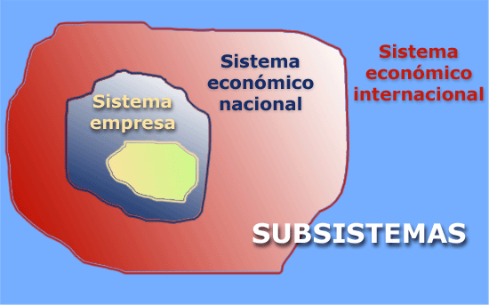

---

Los conceptos de subsistema, sistema y súper sistema llevan implícita la idea de recursividad, por cuanto los subsistemas y los súper sistemas son además, sistemas. En este sentido, las propiedades generales de los tres elementos son semejantes y fácilmente se pueden encontrar analogías y homologías.

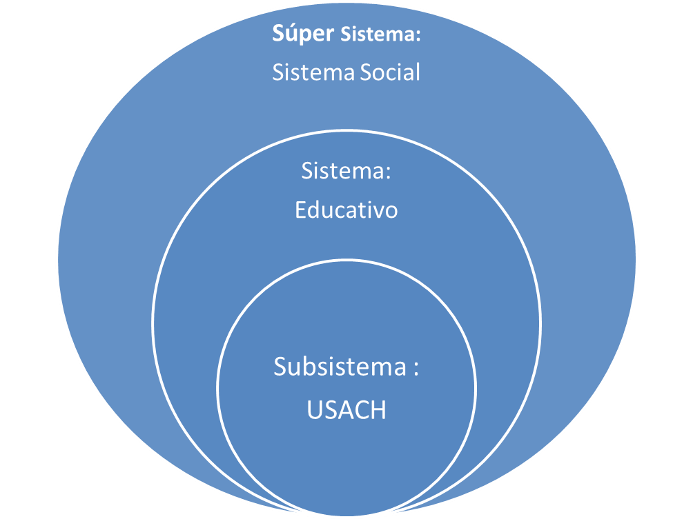

---

Es fácil caer en error cuando buscamos identificar los subsistemas de un sistema, porque no todas sus partes componentes pueden considerarse subsistemas, si es que queremos respetar el principio de la recursividad.

**Ejemplo**: el corazón o el aparato nervioso pueden ser sub sistemas del hombre, pero no la uña del dedo.

En una empresa puede que una función no cumpla con los requisitos para ser considerada un subsist.ema, por ejemplo, el chofer del auto del gerente.

---

El mencionado departamento de investigación es un  sistema que se encuentra compuesto por x personas, pero éste es sólo parte de una unidad mayor; la gerencia de operaciones. Esta, a su vez, es una unidad que posee otros subsistemas, tales como adquisiciones, control de la producción, plantas de producción, unidades de control de calidad, unidad de automatización, etc., que forman parte de un sistema mayor: la empresa. La empresa misma es un subsistema de una industria (por ejemplo planta siderúrgica). La industria es parte a su vez, del sistema industrial, productivo o económico de un país.

## Elementos de un sistema

**Las corrientes de entrada**

Para que los sistemas abiertos puedan funcionar , deben importar ciertos recursos del medio . Así , por ejemplo , el ser humano, para sobrevivir y funcionar, está importando constantemente un número de elementos de su medio : el aire, los alimentos, indispensables para mantenerse; el abrigo, etc. Un sistema industrial compra recursos, materiales (materias primas) , recursos financieros , recursos humanos, equipos , etcétera.

Con el fin de utilizar un término que comprenda todos estos insumos , podemos emplear el concepto de "energía" . Por lo tanto, los sistemas, a través de su corriente de entrada, reciben la energía necesaria para su funcionamiento y mantención.

---

Corrientes de entrada

---

**Proceso de conversión**
¿hacia dónde va esa energía? Todo sistema realiza alguna función.
La energía que importan los sistemas sirve para mover y hacer actuar sus mecanismos particulares con el fin de alcanzar los objetivos para los cuales fueron diseñados.
Los sistemas convierten o transforman la energía (en sus diferentes formas) que importan en otro tipo de energía, que representa la "producción" característica del sistema particular. Por ejemplo La empresa siderúrgica transforma la energía que recibe, ya sea de materias primas, recursos financieros y humanos e información , en planchas y barras de acero, a través de todo un proceso de conversión que va desde el alto horno hasta las laminadoras en frío o  caliente.

---

**Corriente de salida**
La corriente de salida equivale a la "exportación" que el sistema hace al medio . Este es el caso del oxígeno en las plantas; de las planchas de acero , en la empresa siderúrgica ; del transporte en un taxi ; etc.

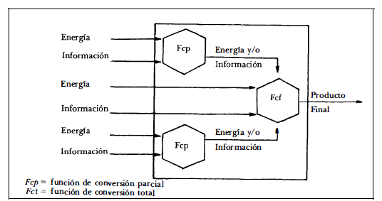

---

Generalmente no existe una sino varias corrientes de salida.
En general podemos dividir estas corrientes de salida como positivas y negativas para el medio y entorno, entendiéndose aquí por medio todos aquellos otros sistemas que utilizan de una forma u otra la energía que exporta ese sistema .
En el caso de la siderúrgica , además de las planchas de acero , puede exportar corrientes de salida negativas . El humo y escoria que contaminan el aire

---

**La comunicación de retroalimentación**

Como todo sistema tiene algún propósito y la conducta que desarrolla, una vez que dispone de energía, prevista por sus corrientes de entrada, tiende a alcanzar ese objetivo . La pregunta es ¿cómo sabe el sistema cuándo ha alcanzado su objetivo? o ¿cuándo existe diferencia entre la conducta que desarrolla para lograr el objetivo y el objetivo mismo? Así, la comunicación de retroalimentación es la información que indica cómo lo está haciendo el sistema en la búsqueda de su objetivo, y que es introducido nuevamente al sistema con el fin de que se lleven a cabo las correcciones para lograr su objetivo (retroalimentación). Es un mecanismo de control que posee el sistema.

---

## Organizacion como sistema abierto

Las organizaciones, como tales son organismos sociales vivos y por consiguiente cambiante, nunca configuran una unidad lista y acabada, pues perdería el dinamismo y la actividad, que son necesarios para mantener la relación con el medio en que se ve inmerso el sistema organizacional.

Los sistemas deben ser abiertos, los sistemas cerrados solo existen en conceptualización, ya que es necesaria la interacción con el medio que rodea el sistema para poder adquirir un estado estable o equilibrio dinámico en la medida que mantiene su capacidad de transformación de energía o trabajo.

---

**Sistema cerrado**

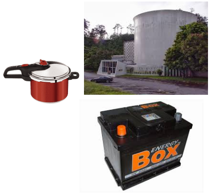

---

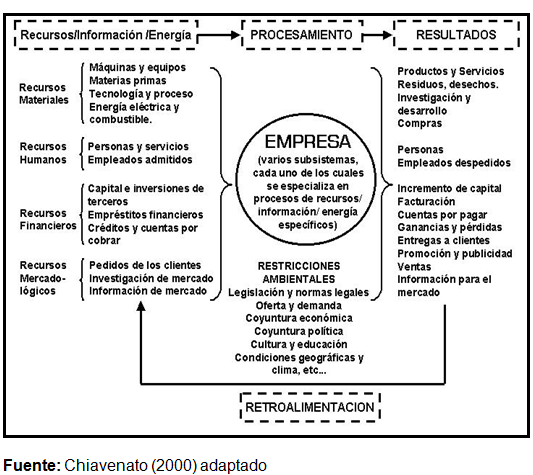

## Sistema organizacional

Las organizaciones son un sistema de actividades, que están coordinadas y tienen la finalidad de lograr un objetivo en común.
Al analizar una organización se debe analizar el sistema organizacional como un todo.

Los principales requisitos para la existencia de un sistema que sea efectivo son los siguientes:

- Hay personas capaces de comunicarse.
- Están dispuestas a actuar conjuntamente.
- Desean obtener un objetivo en común.

---

Una de las características de los sistemas organizacionales, es la disposición de las personas que lo forman, de contribuir en acción; es decir, disposición de **sacrificar el control de su propio comportamiento para beneficiar la coordinación y alcanzar el objetivo que los une**. Esta razón es la que fundamenta la existencia de  roles y funciones dentro  de  las  organizaciones; diferenciadas,  pero interrelacionadas.

---

Otro aspecto, es referente a la complejidad de las organizaciones, tema que se vincula con las **estructuras organizacionales**. Cabe mencionar que las organizaciones deben mantener un equilibrio de actividad con respecto al medio. Al crecer la demanda de lo ofrecido por la organización, es natural que la organización crezca, en términos de estructura, para poder satisfacer la demanda existente. Este caso no es solo para las “salidas del sistema”, el crecimiento afecta también las “entradas del sistema".

## Niveles organizacionales

Podemos definir para nuestros fines, la complejidad ,en relación con las interacciones entre componentes y subsistemas del sistema, y con la variedad de cada uno de los subsistemas. Entendemos por variedad, el número de estados posibles que puede alcanzar un sistema o un componente.

## Estructura organizacional

---

**Nivel superior o estratégico**: Elabora las políticas y estrategias. Determina los objetivos a largo plazo. Se toman decisiones que afectan a toda la organización. En este nivel se encuentran el presidente, el directorio , el gerente  general.

**Nivel medio o táctico**: Coordina las actividades que se desarrollan en el nivel operativo, así como las decisiones que se toman y que afectan a un sector, área o departamento. En este nivel se encuentra el gerente de producción, administración de ventas, etc.
**Nivel inferior u operativo**: Su función es realizar en forma eficaz las tareas que se realizan en la organización.

---

## Caracteristicas de las complejidades del sistema organizacional

- **Complejidad**: Referente a la estructura, diferenciación vertical y horizontal existente.
- **Anonimato**: Referido al énfasis que se hace en las tareas más no en las personas.
- **Rutinas estandarizadas**: Procedimientos y canales de comunicación.
- **Estructuras personalizadas no oficiales**: Propios de la estructura informal.
- **Tendencias a la especialización y la proliferación de funcione**s: El objetivo es separar las líneas de autoridad formal de la competencia profesional o técnica.
- **Tamaño**: Número de personas y dependencias que conforman la organización.

## Sistema administrativo en las operaciones

Confluencia de proceso administrativo, servicios y transformación en planta:

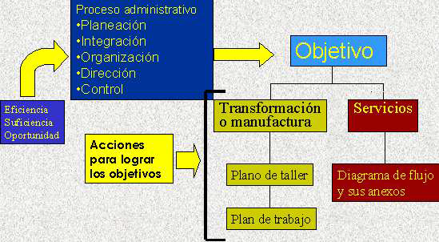

## Proceso administratico

**Planeación**
Implica la elección de las actividades que deben ser ejecutadas para alcanzar los objetivos organizacionales, esbozando la forma en la que dichas tareas deben ser realizadas, e indicando el momento en el que se deben ejecutar.

**Integración**
Integrar es obtener y articular los elementos materiales y humanos que la organización y la planeación señalan como necesarios para el adecuado funcionamiento de un organismo social.

**Organización**
Se concibe como la asignación de tareas desarrolladas durante la planeación a diversos individuos o grupos dentro de la empresa. Esta función crea los mecanismos para poner los planes en acción. Las tareas están diseñadas de tal forma que el rendimiento individual contribuya al éxito de los departamentos (Unidades organizacionales), el cual contribuirá al éxito general de la organización.

**Dirección**
Considera el liderazgo y la motivación, se relaciona principalmente con las personas dentro de las organizaciones. El propósito final es incrementar la productividad.

**Control**
Es en la cual los administradores:
- Reúnen información que mide el desempeño actual de la organización
- Comparan el desempeño  y determinan si la organización debe de ser modificada para satisfacer los estándares preestablecidos.
- Reúnen continuamente información, hacen sus comparaciones, a fin de encontrar nuevas formas de mejorar la producción a través de modificaciones organizacionales.

---

**Ventajas potenciales de la Planeación**

Una de sus ventajas es que ayuda a los administradores a estar orientados hacia el futuro. Estos se ven forzados a ver más allá de sus problemas habituales para proyectar lo que sucederá en el futuro. Otra ventaja es la coordinación de las decisiones y que pone de relieve los objetivos organizacionales.

Sin embargo, si la planeación no es bien ejecutada, puede tener varias desventajas. Por ejemplo:
Un programa de planeación demasiado extenso, demandará más tiempo de los administradores; los administradores deben de tener un equilibrio entre el tiempo de planeación y el tiempo que pasan en sus otras funciones.

---

**Primicia de la planeación**
La planeación es la función que debe de ser ejecutada primeramente, pues las demás funciones están interrelacionadas y dependen de la planeación.

**Planeación estratégica**
Es la planeación a largo plazo que enfoca a la organización como un todo. El largo plazo se define usualmente como un periodo que se extiende de 3 a 5 años hacia el futuro. Por tanto, los administradores están tratando de determinar lo que la organización debe hacer para tener éxito en un punto situado en el periodo establecido.

- Es dirigida por los altos mandos.
- Es un referente general para toda la institución. (Alcance Transversal)
- Genera mayor incertidumbre que los otros dos tipos de planeación.
- No es detallada.
- Su parámetro es la efectividad

---

## Concepto de Sistemas y Planeamiento Estrategico

La planeación puede considerarse como un proceso orientado a:

- Establecer un conjunto de objetivos coherentes jerarquizados;
- Determinar los recursos apropiados.

El término estrategia tiene un origen militar adaptado a la planeación en las organizaciones para fijar objetivos, proyectar pronósticos y tratar de cubrir el diferencial (estado actual y deseado) por medio de líneas genéricas de acción llamadas estrategias.

Para elaborar una planificación estratégica se considera inicialmente, definir la misión y visión de la organización, sus fortalezas y debilidades; las oportunidades y las amenazas que su entorno le proporciona, y que la organización no puede controlar (FODA – 5F de Porter). Desde la perspectiva de sistemas, la organización se encuentra rodeada por el entorno que es todo lo que está fuera del control de la organización; del entorno nos interesa identificar aquellos elementos o variables que afectan o pueden afectarla, ya sea de una manera negativa o positiva

## Planeamiento estrategico - diagnostico

Ejemplo matriz FODA y 5F Michael Porter

---

Ejemplo matriz FODA

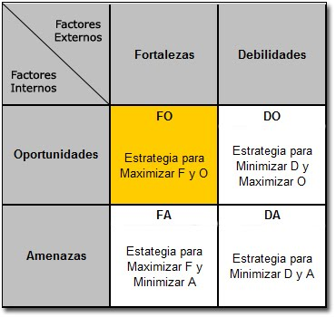

---

5F Michael Porter

## Cadena de valor

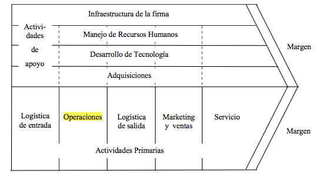

# Sistema de produccion de bienes y servicios

## Sectores economicos y clasificacion

Los **sectores económico**s son la división de la actividad económica de un Estado o territorio en los sectores primario, secundario, terciario y cuaternario.

**Sector primario**

Está formado por las actividades económicas relacionadas con la transformación de los recursos naturales en productos primarios no elaborados. Los productos primarios son utilizados como materia prima en las producciones industriales, considera:

- Sector pesquero (del río o mar)
- Sector ganadero (agrícola)
- Sector minero (de las minas y complementos rocosos)
- Sector forestal (del bosque)

---

**Sector secundario**

Es el sector de la economía que transforma la materia prima, extraída o producida por el sector primario, en productos de consumo o en bienes de equipo, es decir, productos que serán utilizados en otros ámbitos del sector secundario, considera:

- **Artesanía**: resultado de la creatividad y la imaginación, plasmado en un producto en cuya elaboración se ha transformado racionalmente materiales de origen natural, generalmente con procesos y técnicas manuales
- **Industria**: actividad económica surgida en la Primera Revolución Industrial a finales del s. XVIII y principios del s. XIX en Inglaterra y que tiene como objetivo transformar las materias primas en productos comercializables utilizando, para ello, fuerza humana, máquinas y energía.
- **Energía**: proceso mediante al cual se consigue electricidad mediante la conversión de una energía del sector primario.
- **Minería**: (se considera también parte del sector secundario porque a partir de la minería se pueden crear distintos productos).
- **Construcción**: proceso de armado de una estructura cuyo tamaño puede variar desde una casa hasta un rascacielos o infraestructuras como un túnel o una carretera.

---

**Sector terciario**

Es el sector económico que engloba las actividades relacionadas con los servicios materiales no productores de bienes. Considera:

- Comercio : Mayorista, Minorista y franquicias
- Actividades financieras:  Banca, seguros y bolsa
- Servicios personales: Educación, sanidad y atención a la dependencias, servicios públicos, pero también otros como las peluquerías.
- Servicios a empresas: Gestión y administración de empresas, la publicidad, consultorías y asesorías económicas, jurídicas, tecnológica, de inversiones, etc.
- Función pública: Administración pública, seguridad y defensa.
- Hotelería y las actividades en torno al turismo
- Las actividades en torno al ocio , la cultura, el deporte y espectáculos, que incluyen las llamadas industrias audiovisuales y similares.
- Transporte y comunicación (traslado de mercancías o información)
- Medios de comunicación, especialmente los masivos (periodismo escrito, prensa, radio y tv)
- Telecomunicaciones:
- TIC: especialmente la informática e Internet.

---

**Sector Cuaternario**

Produce servicios altamente intelectuales tales como investigación, desarrollo, innovación e información.

incluir servicios tales como la generación e intercambio de información, tecnología consultoría, investigación, y desarrollo, planificación financiera y otros servicios o actividades principalmente intelectuales.

## Clasificacion internacional industrial uniforme (CIIU)

La International Standard Industrial Classification of All Economic Activities (abreviada como ISIC), es la clasificación sistemática de todas las actividades económicas cuya finalidad es la de establecer su codificación armonizada a nivel mundial.

Su propósito es ofrecer un conjunto de categorías de actividades que se pueda utilizar cuando se diferencian las estadisticas de acuerdo con esas actividades.

---

El nivel superior de la clasificación está compuesta por las siguientes secciones:

- A - Agricultura, silvicultura y pesca
- B - Explotación de minas y canteras
- C - Industrias manufactureras
- D - Suministro de electricidad, gas, vapor y aire acondicionado
- E - Suministro de agua; alcantarillado, gestión de desechos y actividades de saneamiento
- F - Construcción
- G - Comercio al por mayor y al por menor; reparación de los vehículos de motor y de las motocicletas
- H - Transporte y comunicación
- I - Alojamiento y servicios de comida
- J - Información y comunicación
- L - Actividades inmobiliarias
- M - Actividades profesionales, científicas y técnicas
- N - Actividades administrativas y servicios de apoyo
- O - Administración pública y defensa; planes de seguridad social de afiliación obligatoria
- P - Enseñanza
- Q - Servicios sociales y  salud humana
- R - Artes, entretenimiento y recreación
- S - Otras actividades de servicio
- K - Actividades financieras y de seguros.
- T - Actividades de los hogares en calidad de empleadores, actividades indiferenciadas de producción de bienes y servicios de los hogares para uso propio.
- U - Actividades de organizaciones y órganos  extraterritoriales

# Conceptualizacion del efonque de procesos

## Concepto de proceso

(1)

Una actividad o un conjunto de actividades que utiliza recursos, y que se gestiona con el fin de permitir que los elementos de entrada se transformen en Resultados.

Frecuentemente el resultado de un proceso constituye directamente el elemento de entrada del siguiente proceso.

(2)

(3)

## Conceptos para comprender los procesos

- *Actividad*
- *Tarea*
- *Procedimiento*
- *Norma*
- *Regla*
- *Dueño de proceso*
- *Cliente*

## Gestion por procesos (1)

(1)

La **gestión** de procesos es una forma sistémica de identificar, comprender y aumentar el **valor agregado de los procesos** de la empresa para cumplir con la **estrategia del negocio** y elevar el nivel de satisfacción de los clientes.

(2)

El gran objetivo de la gestión de procesos es aumentar la productividad en las  organizaciones.

Productividad considera la **eficiencia** y agregar valor para el cliente.

### Mayor productividad

(1)

La mayor productividad se ha transformado en una importante meta de las organizaciones. Es necesario producir cada vez más rápido, con mayor calidad o más económico para poder competir y ser, una opción válida en el mercado.

Se parece a la eficiencia, sin embargo, se usa la palabra productividad cuando el resultado agrega valor para alguien, un cliente del proceso.

Se puede decir que es “producir más con menores recursos agregando valor para el cliente”.

Ejemplo: Con los mismos recursos podemos hacer y tapar más hoyos que el día anterior, eso es eficiencia, pero no productividad porque esa actividad no agrega valor a nadie.

(2)

Productividad es un índice que se obtiene de la división entre producción (output) y recursos (input).

**Productividad** = Producción/Recursos

si no se contempla la satisfacción del cliente, es sólo eficiencia.

**Productividad** = Cantidad de producto obtenido / Cantidad de recursos consumidos.

**Dado que los factores de producción no son muy homogéneos, es difícil determinar una medida de productividad total.**

**Productividad del material** = Producto / Material consumido,

**Productividad del trabajo** = 

Producto / Número de personas, o =
Producto / Horas, o = 
Producto / Horas de fabricación.

**Productividad del capital** = Producto / Número de máquinas.

## Gestion de procesos

(1)

- Consideran en primer lugar al cliente.
- Tienen en cuenta la finalidad, el para qué de su existencia y del esfuerzo de obtener grandes resultados.
- Satisfacen las necesidades de los ―clientes internos, tales como la dirección, los participantes del proceso y los usuarios.
- Los participantes de los procesos están sensibilizados, comprometidos, entrenados, motivados y empoderados.
- La RS está incorporada en el modelo, así como la figura del dueño de proceso.
- Han decidido dejar de hacer las cosas mal: reprocesos, reclamos, stocks, papeles, transacciones en reposo, etc.

(2)

- El rendimiento de los procesos está alineado con la estructura de incentivos de la organización, lo que facilita el cambio y la motivación.
- La dirección de la organización está comprometido con la gestión de procesos y contempla en su presupuesto la inversión necesaria para el cambio.

## Gestion por procesos (2)

(1)

*La gestión de procesos permite una visión* *integral.*

Más allá de un conjunto de actividades, un proceso nos ayuda a entender la globalidad de la tarea que desempeñamos. Es la llamada “visión de procesos”, saliendo de la absurda y miope orientación a la tarea, donde las personas dicen “no es mi responsabilidad” cuando ellos creen haber hecho bien su tarea pero el proceso no funcionó.

(2)

## Enfoque de procesos

(1)

La aplicación de un sistema de procesos dentro de la organización, junto con la identificación e interacciones de estos procesos, así como su gestión para producir el resultado deseado, puede denominarse como **"enfoque basado en procesos"**.

(2)

Un enfoque de este tipo, cuando se utiliza dentro de un sistema de gestión, enfatiza la importancia de:

1. la comprensión y el cumplimiento de los **requisitos**
2. la necesidad de considerar los procesos en términos que aporten valor.
3. la obtención de resultados del desempeño y **eficacia** del proceso.
4. la **mejora continua** de los procesos con base en mediciones objetivas.

## Red de procesos

## Concepto de calidad

(1)

Grado en que un conjunto de características *inherentes* de un objeto cumple con los requisitos.

En la nueva Norma ISO 9000, ahora aparece una nueva definición “objeto” que según la misma norma es “cualquier cosa que pueda percibirse o concebirse”, como por ejemplo, un producto, un servicio, un proceso, un recurso, un sistema, una organización.

(2)

Notas:

1. El término calidad se puede utilizar acompañado de adjetivos tales como pobre, buena o excelente.
2. *Inherente*, en contraposición a *asignado*, significa que existe en algo, especialmente como una característica permanente.

## Gestion de calidad

### Concepto de Gestión de la Calidad

(1)

Actividades coordinadas para dirigir y controlar una organización respecto a la calidad.

Nota. La dirección y control, en lo relativo a la calidad, incluye generalmente el establecimiento de la política de la calidad y los objetivos de la calidad, la planificación de la calidad, el control de la calidad, el aseguramiento de la calidad y el mejoramiento de la calidad.

(2)

(3)

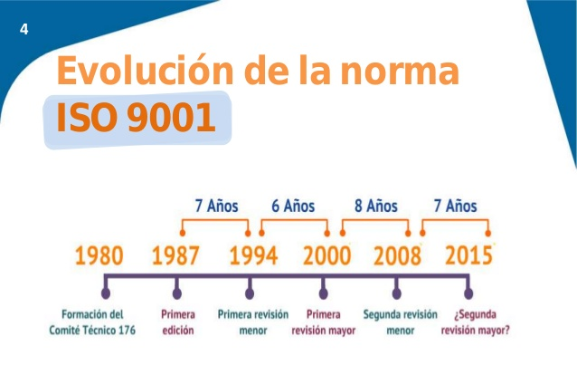

### Principios de Gestión de la Calidad

- **Enfoque** **al cliente**
- **Liderazgo**
- **Compromiso** **de las personas**
- **Enfoque** **a procesos**
- **Mejora**
- **Toma** **de decisiones basada en la evidencia**
- **Gestión** **de las** **relaciones**

# Identificación y clasificación de los Procesos

## Clasificación de los procesos

1. **Procesos Estratégicos**
2. **Procesos del Negocio**
3. **Procesos de Apoyo**

## Identificación de los Procesos

(1)

- El nombre asignado a cada proceso debe ser representativo de lo que conceptualmente representa o se pretende representar.
- La totalidad de las actividades desarrolladas en la empresa deben estar incluidas en alguno de los procesos listados. En caso contrario deben tender a desaparecer.
- Se recomiendan que el numero de procesos no sea inferior a 10 ni superior a 25. Esto es solo es una aproximación que dependerá del tipo de empresa. Como regla general se puede afirmar que si se identifican pocos o demasiados procesos se incrementa la dificultad de su gestión posterior.
- La forma mas sencilla de identificar los procesos propios es tomar como referencia otras listas afines al sector industrial en el cual nos movemos.

(2)

**Ejemplos**

| PROCESOS EMPRESA                     | ACTIVIDADES IMPLICADAS                                       |
| :----------------------------------- | :----------------------------------------------------------- |
| Gestión Estratégica                  | Planificación,  Cultura Empresarial (Propósito, Misión, Valores, Políticas), Elaboración del  Plan de Gestión, Despliegue de objetivos, Definición de indicadores,  Mecanismos de control. |
| Gestión de Personas                  | Planificación  de las necesidades, Selección, Inducción, remuneración, Promoción,  reconocimiento, Evaluación del desempeño, Gestión de equipos, Satisfacción de  las personas. |
| Gestión fabricación                  | Dotación  de Personal, Programa Fabricación, gestión stocks, Grupos de Mejora, Gestión  Operativa, niveles  calidad,  Prevención Riesgos Laborales, Gestión residuos. |
| Gestión Compra                       | Búsqueda  nuevos proveedores, Evaluación proveedores, negociación precios, asignación  pedidos, reconocimiento proveedores. |
| Gestión Comercial y Marketing        | Publicidad,  visitas, reclamaciones clientes, Gestión Clientes Claves, Gestión  compromisos, evaluación satisfacción clientes. |
| Gestión Financiera                   | Planificación  financiera, Tesorería, pagos, Gestión administrativa, inventarios, balances,  auditorias, divisas, riesgos, presupuestos, inversiones. |
| Gestión Prevención Riesgos Laborales | Estrategia  PRL, Legislación aplicable, Evaluación de riesgos, Planificación:   Seguridad, Vigilancia de los trabajadores, Higiene y Ergonomía, Gestión y definición de  objetivos, Política, Sistema de Gestión utilizado, Gestión acciones;  preventivas, correctoras, de mejora y no conformidades, auditorias, revisión  del Sistema PRL |
| Gestión Medioambiental               | Aspectos  Medioambientales: identificación y evaluación, Legislación aplicable, Control  Operacional, Gestión y definición de objetivos, Política, Sistema de Gestión  utilizado, Gestión acciones; preventivas, correctivas, de mejora y no conformidades,  auditorias, revisión del Sistema de Medio Ambiente. |
| Gestión de la Calidad                | Planificación  de la Calidad, Gestión y definición de objetivos, Política, Sistema de gestión utilizado, Gestión de acciones; preventivas, correctivas, de mejora y no conformidades,  auditorias, revisión del Sistema de calidad. |

(2)

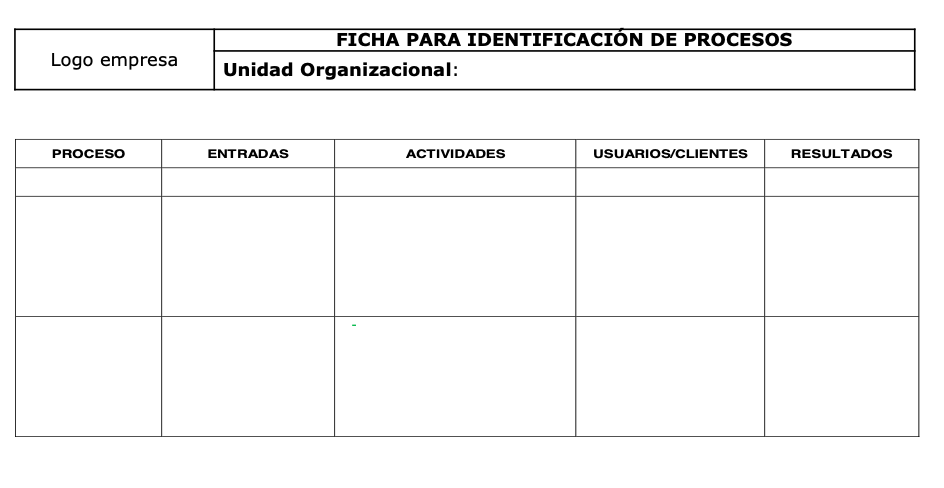

## Ficha de descripción de Procesos

(1)

(2)

(3)

(4)

## Segmentacion de los procesos

### Por cadena

Es la fórmula más simple, son eslabones que se dibujan hacia el lado, de la siguiente forma:

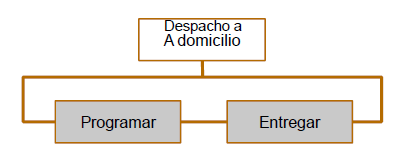

Nótese que es una secuencia obligada, La forma de representar sugiere una cadena, por eso la entrada y salida de las líneas es desde los lados.

### Jerarquías de procesos

Cuando hablamos de jerarquías de procesos hacemos referencia a procesos compuestos por otros procesos, son macro procesos o procesos de alto nivel.

### Versiones de procesos

Se trabaja con pocos y grandes procesos tratando de considerar todas las posibles variaciones de los mismos. Si se trata de un proceso de ventas, se diría: ¿qué sucede si el cliente paga al contado?, y si paga a crédito?, ¿o con cheque?

Para no construir grandes y complicados diagramas. La solución es definir todas las versiones del proceso que sean necesarias.

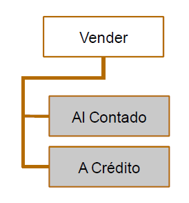

---
###

La clave para segmentar es ubicar el nivel mínimo de desagregación del proceso, al cual se llega por sentido común y aplicando algunas reglas simples:

- Un proceso operativo no se puede dividir más como proceso porque da respuesta a un objetivo preciso y con un fin determinado, útil a la organización.
- Un proceso operativo está compuesto por actividades. Recordemos que una actividad no tiene un fin por sí misma, porque es parte de la secuencia interna del proceso.
- Una actividad es realizada por una persona en un cargo específico.

Las tres principales distinciones que se hacen para segmentar son: ==por cadena, jerarquía y por versiones de procesos==.

## Modelamiento visual de procesos

(1)

El modelamiento visual de los procesos es la propuesta para lograr la participación de todas las personas de la organización.

Es vital, porque ya pasaron los tiempos en que unos pocos modelos eran sólo entendidos por pocos especialistas.

La nueva economía no se basa en la información, en el conocimiento o en la tecnología, sino en la experiencia y la creatividad.

Para efectos del modelamiento visual de los procesos de la organización, utilizamos tres modelos:

- **Mapa de procesos global**
- **Mapa de procesos de ámbito**
- **Flujograma de información**

(2)

**Mapa de procesos global**
Lo primero es contar con la visión de conjunto, global, porque muestra todos los procesos de la empresa. Este mapa debe estar siempre actualizado y pegado en las paredes de cada área.

**Mapa de procesos de ámbito**
El mapa de procesos de ámbito detalla una parte del mapa de procesos global, puede ser un macroproceso o más de uno.

**El Flujograma de Información (FI)**
Describe y representa una guía de las actividades del proceso. Es un tipo de modelo que proporciona amplia información acerca de variados aspectos del proceso.

### Mapa de procesos

Visión de conjunto, holística o “de helicóptero” de los procesos. Se incluyen las relaciones entre todos los procesos identificados en un cierto ámbito y se unen por cadena, jerarquía o versiones.

#### Pasos para elavorar un mapa de procesos

(1)

**Paso 1: Identificar a los actores**

La organización existe porque tiene clientes que atender, pero también depende de sus proveedores y otras organizaciones de su entorno. Una buena manera de empezar es identificar a los agentes o actores que se relacionan con nuestro sistema de gestión: clientes, proveedores, partners, y otras organizaciones con las cuáles mantenemos una relación que tiene relevancia para nuestro sistema de gestión.

(2)

**Paso 2: Identificar la línea de operaciones**

La línea operativa de nuestra organización está formada por la secuencia encadenada de procesos que llevamos a cabo para realizar nuestro producto o servicio. Esta línea viene determinada por la naturaleza de nuestra actividad y por la dosis de innovación que hayamos sabido y podido implementar en nuestro sistema (ingeniería de procesos).

(3)

**Paso 3: Añadir los procesos de soporte a la línea operativa y los de Dirección**

Empecemos por colocar en el mapa una caja llamada GESTIÓN ESTRATEGICA, o como lo definamos. A continuación podemos proceder colocando los procesos de **soporte a la línea operativa**. Estos procesos son los que proveen de recursos a esta línea.

(4)

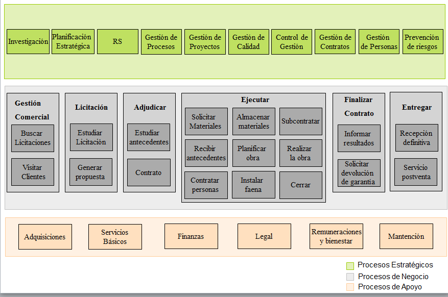

(5)

(6)

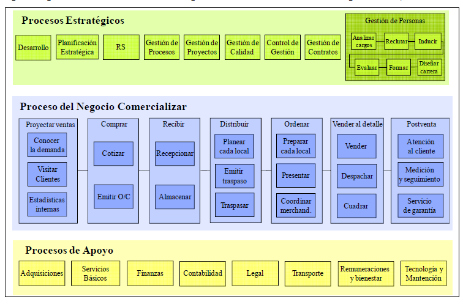

(7)

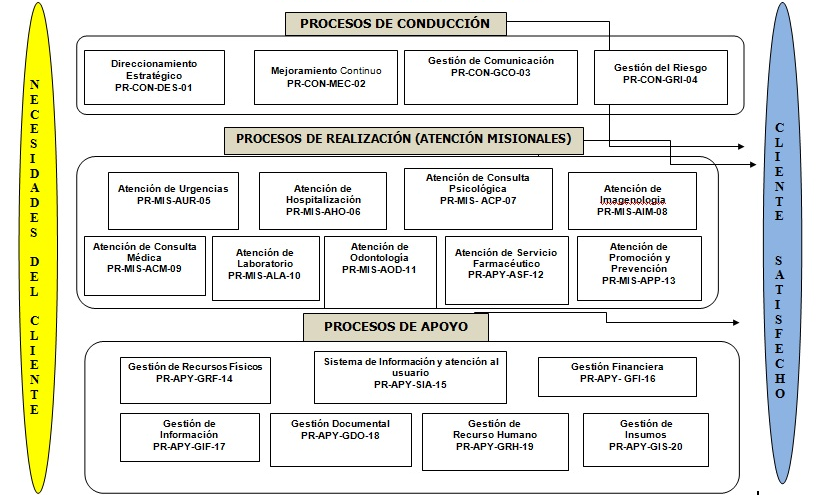

(8)

-facilitando la rápida comprensión de cada actividad y su relación con las demás, el flujo de la información y los materiales, las ramas en el proceso, el número de pasos del proceso, las operaciones interdepartamentales.

(2)

**Reglas para la creación de Diagramas**

1. Los Diagramas de flujo deben escribirse de arriba hacia abajo, y/o de izquierda a derecha.
2. Los símbolos se unen con líneas, las cuales tienen en la punta una flecha que indica la dirección que fluye la información del procesos, se deben de utilizar solamente líneas de flujo horizontal o verticales.
3. Se debe evitar el cruce de líneas.
4. No deben quedar líneas de flujo sin conectar.
5. Todo texto escrito dentro de un símbolo debe ser legible, preciso, evitando el uso de muchas palabras.
6. Todos los símbolos pueden tener más de una línea de entrada, a excepción del símbolo final.
7. Solo los símbolos de decisión pueden y deben tener mas de una línea de flujo de salida.

(3)

Proporciona amplia información acerca de variados aspectos del proceso: *flujo, mensajes, actividades, estructura y tecnología. El flujo es la secuencia y temporalidad,* incluye las actividades e interacciones.

Las actividades son las acciones que realizan cargos o roles. La estructura queda representada por columnas. La tecnología se indica en las actividades que tendrán algún nivel de apoyo tecnológico (las que tienen doble línea).

El FI incorpora todo el detalle necesario porque desarrolla un proceso de bajo nivel.

En el flujograma de información debemos buscar alternativas para evitar la redundancia innecesaria.

(4)

*Simplificar procesos y potenciar personas*

El flujograma describe el *curso normal de los eventos,* donde se describe gráficamente la rutina correcta. Las *excepciones se incluyen* aparte.

El flujograma de información deja espacios para que las personas participen y piensen. Lo nuevo es el principio, se logra aplicando el criterio curso normal de los eventos y a través de capacitación, sensibilización y empoderamiento, entre otras acciones dirigidas a las personas.

### Tipos de Diagrama de Flujo

#### Diagrama de flujo vertical

También denominado gráfico de análisis del proceso. Es un gráfico en donde existen columnas verticales y líneas horizontales. En la columnas verticales están los símbolos o convencionales (de operación, transporte ,control, espera y archivo), los funcionarios involucrados en la rutina, el espacio recorrido para la ejecución y le tiempo invertido.

#### Diagrama de flujo horizontal

La secuencia que se traslada verticalmente, esta lo hace de manera horizontal; este utiliza los mismos símbolos y convenciones que el vertical.

Se destaca a las personas u organismos que participan en un determinado procedimiento.

#### Diagrama de flujo de bloques

Este representa la rutina a través de una secuencia de bloques, cada cual con su significado y encadenados entre sí. Utiliza una simbología mucho más rica y variada que los anteriores, y no se restringe a líneas y columnas preestablecidos. Los analistas de sistemas utilizan este diagrama para representar los sistemas.

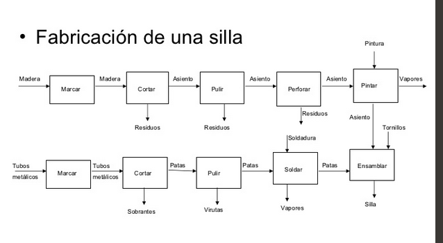

### Beneficios del Diagrama de Flujo

- Es una manera eficaz de entender y mejorar los procesos.
- Es una herramienta simple que estimula la participación.
- Ayuda a capturar las ideas de mejoramiento.
- Establece canales fluidos de modificación de procedimientos.
- Sirve de guía práctica y real a los integrantes del proceso.
- Tiene un efecto de capacitación para nuevas personas.
- Son aceptados por certificadores de normas ISO 9000.
- Tiene un efecto de normalización interna.
- Ayuda en la estandarización con el medio.
- Cuando incluyen los tiempos de las actividades, se aprecian con claridad las necesidades de optimización.

### Componentes (FI)

Unidades  organizacionales, actividades, interacciones e información.

- Las *unidades organizacionales están indicadas en columnas y representan* a cada cargo que tiene relación con el proceso.
- Las *actividades son parte del flujo del proceso y generalmente* realizadas por una persona. Son conjuntos de acciones que se las denomina comenzando por un verbo en infinitivo (cotizar, recibir, almacenar, etc.).
- Las *interacciones también son parte del flujo del proceso y muestran* lo que sucede entremedio.
- La *información corresponde a entradas, salidas y datos almacenados del* proceso y de las actividades en otro nivel de profundidad.

### Características del Diagrama de Flujo

1. Pocas palabras dentro de las cajas.
2. Mantiene la temporalidad. Una actividad que se realiza después va más abajo. Además, así como no podemos retroceder en el tiempo, se evita volver con una línea hacia arriba.
3. Es a nivel atómico.
4. Incluye la estructura organizacional, representada por las columnas que están de fondo. Llega hasta el nivel de cargos.
5. Describe procesos operativos. Es breve (no más de una página).

---

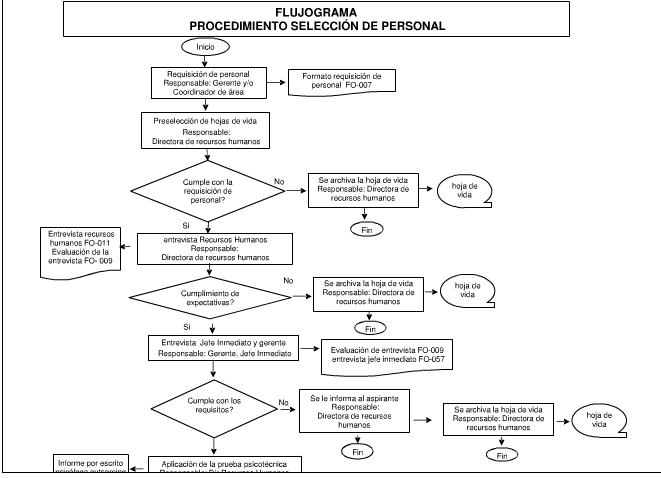

## BPN

[https://www.bizagi.com/plataforma/](https://www.bizagi.com/plataforma/modeler)[modeler](https://www.bizagi.com/plataforma/modeler)

[https://www.youtube.com/watch?v=Lugk5mjBAmw&t=](https://www.youtube.com/watch?v=Lugk5mjBAmw&t=801s)[801s](https://www.youtube.com/watch?v=Lugk5mjBAmw&t=801s)

## Indicadores

(1)

Los indicadores y mediciones siempre acompañan a la gestión de procesos.

¿Qué se mide? Aspectos clave del proceso*.*

El tiempo es la variable más común en la gestión de procesos y la productividad.

También se trabaja en disminuir la cantidad de errores, aumentar la satisfacción del cliente y otros. Una de esas variables es el costo del proceso.

(2)

El tema de las mediciones es uno de los más complejos y al mismo tiempo necesario. Algunas claves pueden ayudar:

1. Defina pocos indicadores y comprométase con ellos.
2. Asegúrese de la oportunidad de la medición.
3. Establezca un rango de normalidad y mire el indicador cuando se salga de ese rango.
4. Actúe en dos líneas de trabajo para el análisis causal:
   - Identifique las pocas causas inmediatas y reaccione con prontitud.
   - Identifique las pocas causas raíces y modifique el proceso para evitar el problema o aprovechar la oportunidad.

(3)

Cuando nos referimos a un proceso, generalmente estamos pensando en transacciones. Entonces, la forma más habitual de generar indicadores es señalar *mediciones por transacción*.

Lo central es medir el desempeño del proceso según el valor agregado a los clientes, desde donde surgen las variables críticas del proceso.

(4)

Importa que la medición del valor agregado de las actividades sea lo más amplia posible, incorporando aspectos cualitativos de importancia para los clientes.

Definir la matriz de indicadores depende de qué es importante para la compañía, lo mejor es concentrarse en las que **efectivamente se utilizarán**. Luego será necesario establecer los sistemas de información que permitirán obtener la información requerida y aplicarla a la mejora, al control de gestión o a la comparación (***benchmarking***) con procesos similares.

### Tipos de Indicadores

#### Calidad del producto y el proceso

- Nivel de cumplimiento de los proveedores (pedidos recibidos fuera de tiempo / total de pedidos).
- Entregas perfectamente recibidas (porcentaje de rechazos respecto al total)
- Control de pérdidas
- Calidad del producto: registro de fallas reportadas internamente.
- Saldos del inventario: mediciones sobre cantidad de productos en stock, etc.
- Eficiencia del inventario: índice de rotación de productos (venta anual / inventario promedio)
- Eficiencia del almacenamiento: costo de almacenamiento por unidad, costo por unidad despachada, nivel de cumplimiento del despacho, costo por metro cuadrado.
- Eficiencia del transporte: comparativo con el medio (costo interno / costo externo), nivel de utilización de camiones (capacidad real utilizada / capacidad real).
- Nivel de creatividad Nº de ideas año / Nº de empleados.
- Efectividad de las ideas: Nº de ideas presentadas / Nº de ideas implementadas.

#### Servicio al cliente

Algunas posibilidades de indicadores asociados a los clientes son:

- Beneficios para el cliente: una fórmula es el cálculo comparativo con otras posibilidades de satisfacer la misma necesidad.
- Nivel de cumplimiento de las entregas a clientes (pedidos no entregados a tiempo / totales).
- Calidad de la facturación: número de facturas erróneas y pendiente por facturar.
- Causales de notas de crédito y montos respecto a ventas.
- Calidad del producto: se lleva registro de fallas reportadas por los clientes.
- Calidad del servicio: se registran reclamos y se realizan encuestas de satisfacción.

#### Costos del proceso

Respecto a costos del proceso, el objetivo es detallar todos los costos por actividad y por transacción: materiales, equipos, insumos y sobre todo, horas hombre. Algunos indicadores específicos:

- Costos logísticos (costos logísticos totales / ventas).
- Margen de contribución (venta real producto – costo real directo) / costo real directo.
- Ventas perdidas (valor pedidos no entregados / venta).
- Costos operativos de la bodega por despacho, etc.

#### Tiempos del proceso por transacción

En cada transacción del proceso podemos identificar tres tipos de tiempos de la gestión de procesos:

1. **Tiempo de duración de la actividad**. Es el tiempo real que invierte cada uno de los operadores en realizar la actividad. No contempla tiempos de espera.
2. **Tiempo de reposo de la transacción**. Es el tiempo que la transacción no está siendo operada, puede ser la boleta por pagar que está en una fila esperando a la cajera, la mercadería esperando por el empaque o por el despacho.
3. **Tiempo de espera del cliente**. Cada vez más importante, es la espera física en una fila para ser atendido.

### KPI

Un **KPI** (*key performance indicator*), conocido también como **indicador clave** **de** **desempeño** o **indicador clave de rendimiento**, es una medida del nivel del desempeño de un proceso. Un KPI se diseña para mostrar cómo es el progreso en un proceso o producto. Existen KPIs para diversas áreas de una empresa: compras, logística, ventas, servicio al cliente, etc. Son mediciones financieras o no utilizadas para cuantificar el grado de cumplimiento de los objetivos; reflejan el rendimiento de una organización y generalmente se recogen en su PE.

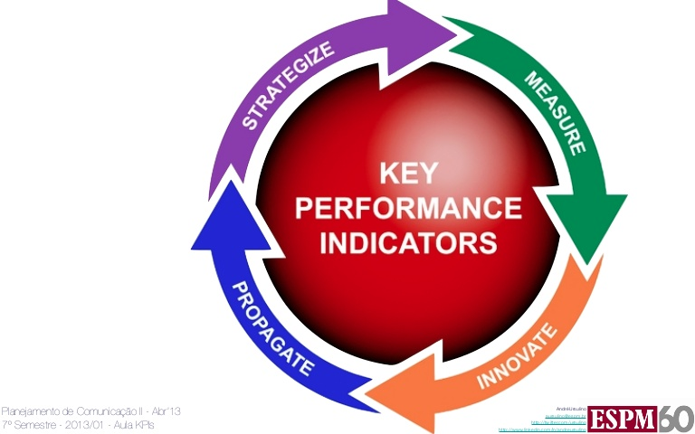

#### Proposito

Los KPIs tienen como objetivo principal medir el nivel de servicio o producto, realizar un diagnóstico de la situación, comunicar sobre la misma y los objetivos, motivar a los equipos responsables del cumplimiento de los objetivos y, en general, evaluar cualquier progreso de manera constante.

Las claves para identificarlos son:

- Tener predefinido un proceso de negocio.
- Tener claros los objetivos o el rendimiento requeridos en el proceso.
- Tener una medida cuantitativa/cualitativa de los resultados.
- Investigar variaciones y ajustar procesos o recursos para alcanzar metas.

#### Identificación

Cuando se definen KPIs se suele aplicar el acrónimo [SMART](https://es.wikipedia.org/w/index.php?title=SMART_(gestión_de_proyectos)&action=edit&redlink=1), ya que los KPIs tienen que ser:

- E**S**pecíficos (**S**pecific)
- **M**edibles (**M**easurable*)*
- Realizable (**A**chievable)
- **R**elevantes (**R**elevant*)*
- **T**emporales/oportunos (**T**imely)

